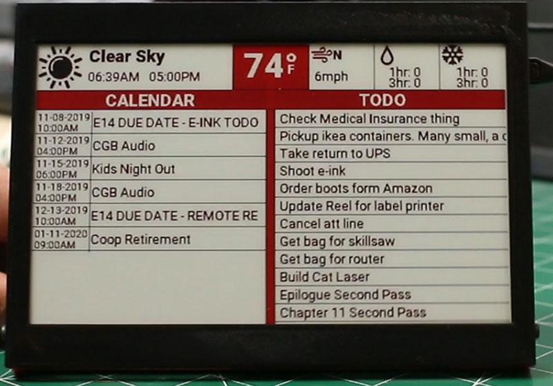

# Infowindow
Rapsberry pi powered e-ink display for displaying information in an always on state. There are several other iterations of this project online, but they didnt do quite what I wanted them to. This is my version. Also keeping up my python skills as they dont get used as much as they used to!

The functionality is not meant to be an "end all solution for calendaring and Todo lists" The intent is to provide an *always  on* display to show me what is coming up next. I can then check in browser, phone, etc for details and updates to the data. In your face reminder.

  <a href="#features">Features</a> |
  <a href="#installation">Installation</a> | 
  <a href="#configuration">Configuration</a> | 
  <a href="#running">Running</a> | 

## Features
* **Calendar**
  * Google Calendar is the only calendar currently supported
* **Todo List**
  * Todoist
  * Teamwork.com
* **Weather**
  * Open Weather Map current data only. Future plan for forecast data.

## Installation
### Get software
Clone this repo onto your raspberry pi. Does not really matter where it is, but good option is in the `pi` users home directory: `/home/pi/InfoWindow`

### Setup python modules
Run `pip install -r requirements.txt`. This should install all required modules. I stuck to basic standard modules for ease of installation.

## Configuration
You will need to configure a few things such as API Keys and location. Copy config.json-sample to config.json. Edit config.json to add your api keys and other information. 

### General
* rotation: 0 - This is the rotation of the display in degrees. Leave at zero if you use it as a desktop display. Change to 180 if you have it mounted and hanging from a shelf.

### Todo
Todoist is the current active module in this code. It only requires `api_key`. Teamwork also requires a 'site' key. If using google tasks, leave this as null `todo: null`
* api_key: Enter your todoist API key.

### Weather
Open Weather Map is where the data is coming from in the default module. This requires a few keys.
* api_key: Get your api key from OWM website.
* city: Look at OWM docs to figure what your city name is. Mine is "Sacramento,US"
* units: This can either be `imperial` or `metric`

## Running
### First Run
You should run the script manually the first time so that Googles auth modules can run interactivly. Once that has completed you will want to add this to CRON so it runs every few minutes automatically.

### Cron Run (Normal use)
* Run `crontab -e`
* insert `*/6 * * * * /usr/bin/python /home/pi/InfoWindow/infowindow.py --cron` 

